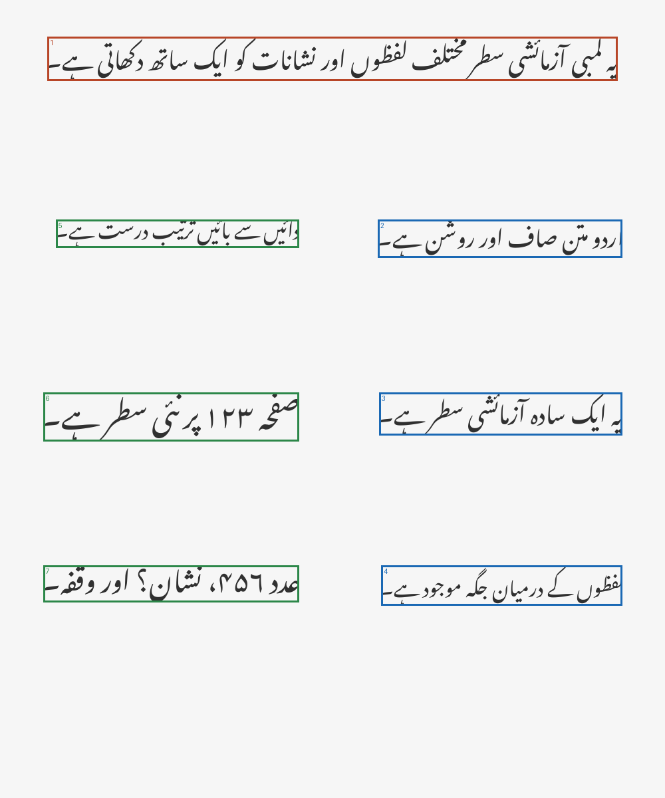

# Urdu Document OCR

Foundation for a reproducible Urdu document OCR system with typed document, vision,
recognition, training, and evaluation contracts.

## Status

This is an active, clean public reimplementation built in incremental verified phases. Through
Phase 8 it implements the package foundation, bounded PNG/JPEG/PDF ingestion, deterministic
classical preprocessing, classical-CV line segmentation, conservative one/two-column layout,
Urdu RTL reading order, reproducible OCR dataset engineering, and provenance-cleared synthetic
Urdu fixtures. It does **not** yet provide OCR text recognition, training, model inference,
evaluation metrics, CLI business commands, or HTTP serving.

## Planned architecture

```text
document
  -> validated ingestion
  -> preprocessing and blank-page detection
  -> line segmentation and one/two-column RTL ordering
  -> line crops
  -> CNN-BiLSTM-CTC recognition
  -> ordered line and page results
  -> document assembly
  -> evaluation, Python API, CLI, and reference HTTP API
```

Only the contracts shared by those layers exist today. Planned modules are added in their owning
phase, with tested behavior, rather than created as empty scaffolding.

## Current implemented scope

- Bounded filesystem-path and in-memory byte ingestion for PNG, JPEG, and PDF documents.
- EXIF-aware image decoding into owned RGB `uint8[height,width,3]` arrays without embedded
  metadata or absolute source paths.
- In-memory pypdfium2 rasterization with page-count, DPI, per-page pixel, and cumulative-pixel
  preflight checks.
- Deterministic grayscale, Otsu or Sauvola thresholding, and True-is-foreground polarity.
- Optional CLAHE, small median denoise, 3x3/5x5 opening or closing, and confidence-gated deskew.
- Three-signal blank-page classification that preserves every page and its original position.
- Eight-connected foreground-component analysis with robust, scale-relative line grouping.
- Conservative attachment of nearby dot/diacritic-like marks and filtering of isolated specks.
- One-column and persistent-gutter two-column layout inference with right-column-first ordering.
- Geometric spanning regions placed in vertical reading bands, including headings and footers.
- Owned grayscale or foreground line-crop extraction from immutable `LineRegion` geometry.
- Strict canonical UTF-8 JSONL manifests with root-contained PNG/JPEG validation.
- Deterministic document-grouped train/validation/test splits with achieved-ratio evidence.
- Train-derived Unicode vocabulary construction, persistence, and unseen-character reporting.
- Immutable, source-fingerprinted review overlays with no image relocation or deletion.
- Half-open bounding-box geometry with intersection, containment, clipping, and IoU.
- Privacy-aware source, page, preprocessing, line-region, OCR-result, and dataset contracts.
- Deterministic CTC vocabulary indexing and SHA-256 fingerprints.
- Structural edit/evaluation result records; metric algorithms are not implemented yet.
- Strict input-limit, recognizer, and training configuration records.
- Portable relative dataset-path validation.
- Safe JSON-compatible projections that exclude image pixel arrays and local filesystem paths.
- Automated tests, Ruff checks, and a Python 3.11 CI workflow.
- Deterministic variable-width Urdu line rendering through reviewed HarfBuzz/FreeType shaping.
- Ten synthetic page/layout families with half-open ground truth, including RTL columns,
  spanning bands, blank pages, near-blank pages, and mild skew.
- A small safe public fixture package with project-authored text, grouped splits, a train-only
  synthetic vocabulary, provenance records, and SHA-256 artifact inventory.

## Core API

```python
from urdu_document_ocr import (
    PreprocessingConfig,
    SegmentationConfig,
    load_document,
    preprocess_page,
    segment_page,
)

pages = load_document("scan.pdf")
processed = tuple(
    preprocess_page(page, PreprocessingConfig(threshold_method="sauvola")) for page in pages
)
regions = tuple(segment_page(page, SegmentationConfig()) for page in processed)
```

The default preprocessing path uses Otsu and does not enable enhancement, morphology, or
deskew. Segmentation consumes only the normalized foreground mask and returns ordered geometry,
not recognized text. See [architecture details](docs/architecture.md) for exact limits and
decision rules, and [OCR data format](docs/data-format.md) for labeled-data contracts.

Dataset operations are ordinary library APIs:

```python
from urdu_document_ocr import (
    build_vocabulary,
    read_manifest,
    split_dataset,
    validate_dataset,
)

samples = read_manifest("manifest.jsonl")
report = validate_dataset(samples, dataset_root="dataset")
split = split_dataset(samples)
training_vocabulary = build_vocabulary(split.train)
```

Segmented document lines do not acquire transcriptions automatically. Dataset manifests describe
separately labeled line images supplied by the caller.

Synthetic fixtures can be regenerated without network access:

```console
python scripts/generate_sample_data.py --output data/sample --overwrite
```

The command writes only to the explicit destination and rejects unrelated existing files. See
[synthetic data](docs/synthetic-data.md) and the [fixture package](data/sample/README.md).



## Provenance boundary

This repository is a clean, self-contained public reimplementation informed by earlier
professional work on Urdu/Nastaliq OCR. Historical datasets, trained weights, internal source
code, private infrastructure, and deployment assets are not included. Current code is newly
implemented; external algorithms, libraries, fonts, and public assets are cited and licensed as
applicable.

See the [source ledger](docs/provenance/source-ledger.md),
[behavioral reference record](docs/provenance/behavioral-references.md), and
[security policy](docs/security.md).

## Development setup

Python 3.11 or newer is required. The current dependency constraint intentionally retains Python
3.11 compatibility.

```console
python -m venv .venv
python -m pip install --upgrade pip
python -m pip install -e ".[dev]"
python -m ruff check .
python -m ruff format --check .
python -m pytest
```

## Roadmap

1. Trainable CNN-BiLSTM-CTC recognition and safe checkpoints.
2. End-to-end inference, evaluation, CLI, and a thin reference API.
3. Reproducible synthetic benchmarks and final publication audit.

No production or accuracy claim is made at this stage. Repository licensing is intentionally
unresolved; public visibility does not itself grant reuse rights.
